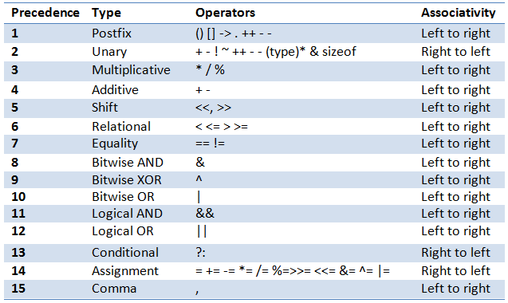

# Kombinierte Zuweisungsoperatoren
{: .reading}

Neben dem einfachen Zuweisungsoperator ``=`` existieren zusätzlich noch die kombinierten Zuweisungsoperatoren (zB ``+=``, ``-=``, ``*=``, ``/=`` , ...). Sie werten jeweils zunächst den Ausdruck auf der rechten Seite aus, führen anschließend die jeweilige Operation mit der links stehenden Variablen aus, und weisen schließlich das Ergebnis wieder der links stehenden Variablen zu. Somit ist beispielsweise ``x -= 1`` eine Kurzschreibweise für ``x = x - 1``.

````cpp
a += b // a = a + b
````
````cpp
a -= b // a = a - b
````
````cpp
a *= b // a = a * b
````
````cpp
a /= b // a = a / b
````
````cpp
a %= b // a = a % b
````
````cpp
a &= b // a = a & b
````
````cpp
a |= b // a = a | b
````
````cpp
a ^= b // a = a ^ b
````
````cpp
a <<= b // a = a << b
````
````cpp
a >>= b // a = a >> b
````

# Operatorpräzedenz
Die Operatorpräzendenz gibt an in **welcher Reichenfolge** Operatoren ausgewertet werden. Quasi eine Erweiterung der *KLAPUSTRI* Regel (Klammer vor Punkt- vor Strich-rechnung).



Wie auch in der Mathematik kann die Auswertungsreihenfolge von Operatoren durch **Klammerung** explizit angegeben werden. Geklammerte Ausdrücke werden von Innen nach Außen ausgewertet.

````cpp
3 * ((4 * (8 - 6)) / (4 + 2))
````

> Bei Unsicherheiten: **Besser zu viele als zu wenige Klammern**