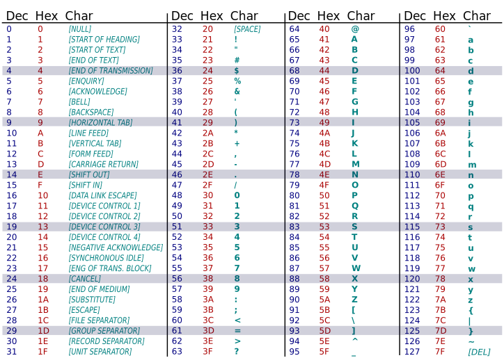

# Zeichenketten in C
{: .reading}

Der Datentyp ``char`` ist zum einen der kleinste Ganzzahlendatentyp den C anbietet (in der Regeln ein Byte groß). `char` wird aber auch zum **Speichern von Buchstaben und Symbolen** verwendet.

## Ausgabe von Zeichen

Will man ein char nicht als Zahl sondern das entsprechende
Zeichen ausgeben kann der Formatierplatzhalter %c verwendet
werden

````cpp
#include <stdio.h>
int main()
{
    char x = 65;
    printf("%d\n", x);
    printf("%c\n", x);
}
````
````plaintext
65
A
````

Welche Zahl welchem Symbol entspricht ist dabei nicht in C festgelegt, sondern wird durch den verwendeten **Zeichensatz** bestimmt.\
Der Zeichensatz ist eine Tabelle die die Beziehung **Zahl <-> Symbol** enthält. Der bekannteste Zeichensatz ist [ASCII](https://de.wikipedia.org/wiki/American_Standard_Code_for_Information_Interchange).



## Eingabe von Zeichen

Es ist klarerweise **etwas mühsam** in einer Zeichensatztabelle
nachsehen zu müssen wenn man ein Zeichen in einem char
speichern will.

Zudem müsste man seinen Code manuell anpassen wenn sich
der **Zeichensatz ändert**.

Man kann den Compiler daher anweisen für ein Zeichen
**selbstständig die korrekte Zahl zu ermitteln** indem man das Zeichen
in einfache Anführungsstriche setzt.

Beispiel:
````cpp
#include <stdio.h>
int main()
{
    char x = 'A';
    printf("%d\n", x);
    printf("%c\n", x);
}
````

````plaintext
65
A
````

[>Try it yourself<](https://repl.it/@m0stlyharmless/MCIProg2ExChar#main.c){:target="_blank"}

## Escape-Sequenzen

Es gibt einige Zeichen die man häufiger benötigt, aber nicht
direkt als Zeichen tippen kann (z.B. Newline, Tabulator,
Anführungsstrich, etc.)

Solche Zeichen werden als Kombination von einem Backslash ``\``
und einem Symbol geschrieben (**sogenannte Escape-Sequenzen**)

Beispiele:
- ``\n`` &nbsp;&nbsp;Newline
- ``\t`` &nbsp;&nbsp;Tabulator
- ``\\`` &nbsp;&nbsp;Backslash
- ``\'`` &nbsp;&nbsp;Anführungszeichen