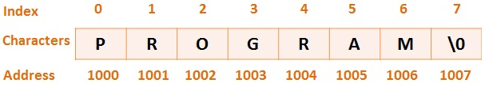

# Strings
{: .reading}

**Strings** werden verwendet um **Zeichenketten** zu speichern. In C existiert dafür kein eigener Datentyp, es ist einfach ein **Array vom Typ ``char``**.

> Hinweis: Das Ende des Strings ist durch das spezielle Zeichen ``'\0'`` gekennzeichnet, **nicht durch die Größe des Arrays**.

## String im Speicher

Soll in C die Zeichenkette `"PROGRAM" `mit 6 Zeichen gespeichert werden, so werden im Speicher dafür 7 Symbole angelegt (*Anzahl der Zeichen* + *String-Ende-Zeichen*).

````cpp
char str[] = "PROGRAM";
````



> **Achtung:** ``'\0'`` ist das Zeichen das der Zahl ``0`` entspricht und nicht das Zeichen ``'0'``!

## Deklaration & Initialisierung

Ein String wird wie jedes andere Array deklariert, nur dass der Datentyp ``char`` ist.

Beispiel:
````cpp
char bla[1024];
````
Ein Array in dem ein String mit maximal
**1023 Zeichen** gespeichert werden kann. **Nicht 1024** weil am
Ende noch für das ``'\0'`` Platz sein muss.

> Eine **Stringkonstante** ist ein String der direkt im Quellcode steht
und wird durch doppelte Anführungsstriche `"` gekennzeichnet:\
``"Das ist eine Stringkonstante"``\
Das ``\0`` für den Abschluss des Strings wird automatisch eingefügt!

Beim Erzeugen eines Strings (und nur dort) kann direkt eine
Stringkonstante zugewiesen werden. Wird für die Größe des Arrays nichts angegeben, wird das Array genau so groß gemacht, dass die Stringkonstante darin gespeichert werden kann.

Beispiele:
````cpp
char str1[] = "Das ist der Inhalt von str1";
````
````cpp
char str2[1000] = "In str2 ist nach diesem Text noch viel Platz!";
````

> **Achtung:** Wenn das Array einmal erzeugt ist, kann man keinen String mehr mit ``=`` zuweisen!
> 
> ```` cpp
> char str[1024];
> str = "Hello World!"; // Compilerfehler!!
> ````

**Unüblich**, aber möglich, da es sich bei Strings um normale Arrays handelt, kann man auch die Array-Initialisierung mit ``{}`` verwenden. Dabei muss man allerdings selbst das `'\0'` einfügen:

````cpp
char str3[6] = {'H', 'a', 'l', 'l', 'o', '\0'};
char str4[ ] = {'H', 'a', 'l', 'l', 'o', '\0'}; /* Größe 6 */
````

## Die Problematik mit Strings

Strings in C können bei angehenden Programmieren viel Verwirrung stiften, weil sie *scheinbar* anderen Regeln folgen als andere Datentypen. Beachte dazu folgendes Beispiel:

````cpp
char str1[] = "Hello";
char str2[] = "World";
char str3[1024];
str3 = str1; // Kopiert KEINEN String
str1 + str2; // Hängt die beiden Strings NICHT zusammen
str1 == str2; // Vergleicht NICHT ob beide Strings gleich sind
````

Wenn man allerdings einen Schritt zurückgeht und sich das obige Beispiel genau ansieht, so wäre man **vor diesem Kapitel** auch nie auf die Idee gekommen, dass diese Operationen so funktionieren sollten:\
In erster Linie ist ein String ein ``char`` Array, dessen **Variablenname ein Zeiger** ist. Zuweisung, arithmetische und logische Operationen funktionieren daher ganz normal nach den Regeln von Zeigern.

### String Länge

Ein großes Problem von Strings ist, dass **die Länge des Strings
und die Größe des Arrays** in dem der String gespeichert ist
**nichts miteinander zu tun** haben.\
Es kann also sehr leicht passieren, dass eine Funktion die
Strings verarbeitet **über die Arraygrenzen hinaus** schreibt oder
liest.

Man bezeichnet diese Fehler als **Buffer Overflow** und sie stellen eine der größten Sicherheitsprobleme in C-Programmen dar.

